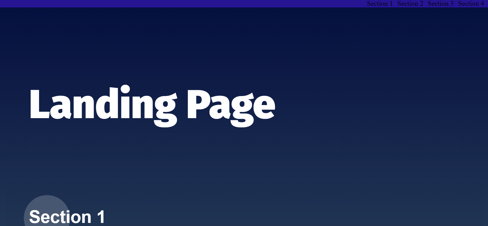

<!-- Add banner here -->

# Udacity-Landing-Page

a simple landing page with an interactive navigation bar and a back to top button 

# Demo-Preview

<!-- Add a demo for your project -->

# Table of contents

- [Project Title](#Udacity-Landing-Page)
- [Demo-Preview](#Demo-Preview)
- [Table of contents](#table-of-contents)
- [Installation](#installation)
- [Usage](#usage)
- [Technologies](#Technologies)
- [Author](#Author)
- [Credits](#Credits)

# Installation
just instal any browser -in case you dont have one- and open the index.html file
[(Back to top)](#table-of-contents)

# Usage
a dynamice navigator created automatically for any blog with many posts which allows u to navigate easily between your posts and also you can easily back to top at any moment down there 
[(Back to top)](#table-of-contents)

# Technologies
* HTML
* CSS
* JS  

[(Back to top)](#table-of-contents)

# Author
Moaaz Mansour  

[(Back to top)](#table-of-contents)

# Credits
**thanks UDACITY**  

[(Back to top)](#table-of-contents)
